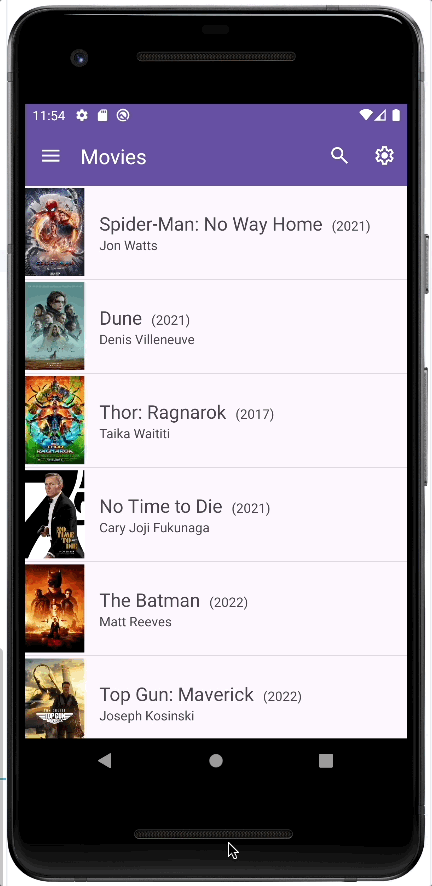
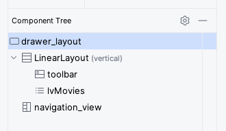

# Tutorial aplicación "Movies"

Este repositorio contiene el código inacabado de la aplicación Movies. Al ejecutar la aplicación en este estado inicial, podemos observar que no muestra información por pantalla:

<p>

El objetivo de la aplicación, una vez terminada, será el de mostar en la pantalla principal una lista de películas con su información básica. Cuando se pulse sobre cualquier película, deberá mostrar una ventana flotante con más información sobre la película seleccionada. Además la aplicación deberá tener una opción de filtrado de la lista, y un menú para configurar la información que se muestra en la lista. El resultado final que se pretende conseguir se muestra en las siguientes animaciones:

<p>
<p>

## Estado inicial de la aplicación

A continuación se explica el estado inicial de la aplicación.

### Fuente de datos 

Es fundamental tener definido un modelo de Película. El código inicial ya lo implementa en la carpeta `models/Movie.java`. Este modelo almacena la siguiente información para cada película:

- Título
- Año
- Director
- URL para el póster
- Sinópsis
- Actores principales

Para desarrollar la aplicación debemos tener también una fuente de datos con películas. Esto típicamente se haría conectándonos a un servicio online como [TMDB](developer.themoviedb.org). Para esta aplicación simple de prueba, vamos a usar los datos estáticos que están definidos en el fichero `res/raw/movies.json`. El acceso a estos datos se va a realizar a través de la DAO `data/MoviesDao.java`, que proporciona las operaciones típicas de una DAO. Es importante tener en cuenta que esta DAO no persiste los cambios que se realicen en los datos.

### Layout de la actividad principal

El layout de la actividad principal (`activity_main.xml`) ya contiene todos los elementos necesarios, que se muestran en la siguiente captura de pantalla, y se pueden observar si abrimos el fichero `res/layout/activity_main.xml`:



Los elementos principales son:

- Un `DrawerLayout` con id `drawer_layout` para mostrar un menú deslizante desde la izquierda de la pantalla
- Un `LinearLayout` vertical para contener los elementos principales de la pantalla.
- Un `NavigationView` con id `navigation_view` que es necesario para controlar el `DrawerLayout`

Dentro del `LinearLayout` se incluyen los dos elementos principales de la pantalla:

- Un `Toolbar` con id `toolbar` que actua como la barra principal de la pantalla que se situa en la parte superior. Esta barra será el *ActionBar* de la aplicación.
- Un `ListView` con id `lvMovies` para mostrar una lista vertical de películas.

###  Código de la actividad principal

El código de la actividad principal está definido en `MainActivity.java`. Incluye los siguientes métodos:

- `onCreate`: este es el método que se ejecuta automáticamente cuando Android requiere crear la actividad. En la implementación actual configura el `DrawerLayout`, instancia la DAO de películas (`MoviesDao`), y mediante una llamada el método `fetchMovies` obtiene de la DAO una lista de películas que almacena en `allMovies` y `shownMovies`. En este método inicialmente falta configurar el `ListView` para que muestre las películas.

- `fetchMovies`: este es el método que se se ha creado para pedir a la DAO que nos retorne la lista de películas.

- `configureAdapter`: este método se utiliza para configurar el *Adapter* del `ListView` de acuerdo a la configuración almacenada en las preferencias de la aplicación.

- `onRestart`: este método se ejecuta automáticamente cuando la actividad es reiniciada. Por ejemplo, cuando se retorna desde otra actividad de la aplicación.

- `onOptionsItemSelected`: este es el método que se llama automáticamente cuando se pulsa cualquier elemento del *Options Menu*, que son los items que aparecen en el *Actions Bar* de la aplicación (la barra superior).

- `onNavigationItemSelected`:  este es el método que se llama automáticamente cuando se pulsa cualquier elemento del menú deslizante `DrawerLayout`.

- `onCreateOptionsMenu`:  este es el método que se llama automáticamente para crear los items del *Options Menu*. Inicialmente este menú incluye dos items: barra de búsqueda y un botón para acceder a la configuración de la aplicación. Este menú se define en el fichero `res/menu/action_menu.xml`

- `showMoviePopupDetails`: este método se ha creado para mostrar una ventana flotante con la información detallada de una película. Inicialmente este método está sin implementar. 

- `filterMoviesList`: este método se ha creado para filtrar la lista de películas de acuerdo a un *substring* que se proporcione al método. Inicialmente este método está sin implementar. 


## Tutorial

Aquí comienza el tutorial para completar la aplicación. El tutorial contiene 4 fases:

1. Visualización de la lista de películas
2. Visualización de los detalles de una película
3. Filtrado de la lista
4. Configuración de la información que se muestra

### Visualización de la lista de películas

El primer objetivo es mostrar una lista de películas en la actividad principal de la aplicación. Como se vio anteriormente, el *layout* de la actividad principal ya incluye un `ListView` (id=`lvMovies`). Como primer paso debemos configurar este `ListView` para que muestre las películas que nos suministra la DAO.

La forma de suministrar la información a un `ListView` es a través de un *ListAdapter*. En esta aplicación se proporciona una implementación inicial e incompleta de este adapter en la clase `MoviesAdapter`, que extiende a la clase abstracta `BaseAdapter` (que a su vez implementa `ListAdapter`).

La clase `MoviesAdapter` recibe en su constructor la lista de películas que se deben mostrar (`List<Movie>`). El método principal de `MoviesAdapter` es `getView`. Este método recibe como parámetro de entrada `int position`, y debe retornar un objecto `View` que represente la información de la fila `position` de la lista. Este metodo es llamado automáticamente por el `ListView`. 

El *layout* que queremos que utilice cada fila del `ListView` está denifido en `res/layout/movies_list_item_layout.xml`. Este layout contiene estos elementos:

- Un `Imageview` (id=`ivCover`) para mostrar el poster de la película.
- Un `TextView` (id=`tvTitle`) para mostrar el título de la película
- Un `TextView` (id=`tvYear`) para mostrar el año de la película
- Un `TextView` (id=`tvDirector`) para mostrar el director de la película


En Android, al proceso de instanciar un objeto `View` a partir de un layout (como `res/layout/movies_list_item_layout.xml`) se le conoce como "Inflado". 

En la implementación inicial del método `MoviesAdapter.getView`, el inflado del *layout* de la fila se realiza en el siguiente código:

```java
if (convertView == null) {
    LayoutInflater inflater = LayoutInflater.from(context);
    convertView = inflater.inflate(R.layout.movies_list_item_layout, parent, false);
}
```

> [!IMPORTANT]
> Como primera tarea, hay que completar el código de `MoviesAdapter.getView` para que el objeto `View` que retorne contenga la información de la película número `position`. Para llevar a cabo esta tarea, se proporcionan los siguientes consejos:

> [!TIP]
> La película que está en la posición `position` se puede obtener a través del método que ya está implementado `getItem`

> [!TIP]
> Para obtener el puntero a los *widgets*, se puede usar el método `findViewById`. Por ejemplo, para obtener el `ImageView` se puede ejecutar:

```java
ImageView ivCover = convertView.findViewById(R.id.ivCover);
```

> [!TIP]
> Para mostrar una imagen de internet en un `ImageView` se puede usar la librería [Picasso](https://square.github.io/picasso/) (ya instalada). Por ejemplo:

```java
Picasso.get().load(movie.getCoverUrl()).into(ivCover);
```

Con estas acciones, la clase `MoviesAdapter` queda completada.

> [!IMPORTANT] 
> La siguiente tarea consiste en configurar el `ListView` para que utilice el *adapter*. Esto se debe realizar en el método `MainActivity.onCreate`

> [!TIP]
> Los objetos `ListView` tienen un método `setAdapter`

Si se ha realizado la implementación correctamente, al iniciar la aplicación debería ahora mostrarse una lista con la información de las películas.

### Visualización de los detalles de una película

El objetivo es hacer que al pulsar una película de la lista, se muestre en una ventana emergente información más detallada sobre la película. 

> [!IMPORTANT]
> Lo primero que hay que hacer es añadir un listener al `ListView` para que responda cuando se pulsa en una película. Esto se debe realizar en el método `MainActivity.onCreate`

>[!TIP]
> Los objetos `ListView` tienen un listener llamado `OnItemClickListener` que es el que responde cuando se pulsa un elemento de la lista.

>[!TIP]
> En el listener tenemos que obtener el objeto `Movie` que se representa en la fila pulsada de la lista. Al método del listener se le proporcionan como parámetros la vista de la fila (el `View` que se creó previamente en `MoviesAdapter`), la posición pulsada, y un identificador de la posición pulsada. Para obtener el objeto `Movie` asociado a la fila, se puede utilizar el número de la posición (`position`) y acceder a dicha posición en la lista `List<Movie>` que ya posee `MainActivity`. Otra forma es mediante el atributo `tag` del `View`, en el que se puede almacenar cualquier objeto arbitrario:

```java
// en MoviesAdapter
...
convertView.setTag(movie)
...

// en el listener OnItemClickListener
...
Movie movie = view.getTag()
...

```

> [!TIP]
> El listener debe llamar al método `showMoviePopupDetails`, que es el encargado de mostrar la ventana emergente. 


Las ventanas flotantes en Android se llaman `AlertDialog`. Existen `AlertDialog` predefinidos para mostrar información básica, pero también permiten representar cualquier layout que proporcionemos. En esta aplicación ya se ha creado el *layout* que se debe mostrar, y se encuentra en el fichero `res/layout/movie_dialog_layout.xml`. Este layout, adicionalmente a lo que ya se muestra en la lista, añade dos `TextView` adicionales:

- Un `TextView` (id=`tvSynopsis`) para mostrar la sinopsis de la película.
- Un `TextView` (id=`tvActors`) para mostrar los actores de la película

En el código inicial de `showMoviePopupDetails` ya se infla este *layout*, y se almacena en la variable `dialogView`.

> [!IMPORTANT]
> Por lo tanto debemos modificar este `dialogView` para que muestre la información de la película que ha sido pulsada (la película se suministra como parámetro del método).

> [!TIP]
> Utilizar el método `findViewById` para acceder a los elementos del `dialogView`

>[!IMPORTANT]
> La siguiente tarea consiste en crear el `AlertDialog` para que muestre el contenido de `dialogView`:

> [!TIP]
> La creación de los `AlertDialog` se realiza utilizando el patrón *Builder*. Este objeto *builder* ya está creado (variable `builder`)

> [!TIP]
> El *Builder* tiene un método `setView` para especificar qué contenido se debe mostrar en la ventana flotante.

> [!TIP]
> Es recomendable añadir un botón a la ventana flotante, para facilitar la acción de cerrar la ventana. La forma más sencilla de añadir un botón a la ventana es mediante el método `setPositiveButton` del *Builder*.

> [!TIP]
> El método `create` del *Builder* crea el objeto `AlertDialog`

> [!TIP]
> Los objetos `AlertDialog` tienen un méodo `show` para mostrar el diálogo por pantala

Si se ha realizado la implementación correctamente, al pulsar sobre una película de la lista, se debería mostrar una ventana flotante con información adicional de la película

### Filtrado de la lista según título

En el *OptionsMenu* se ha incluído un campo de texto para filtrar la lista de películas de acuerdo al *string* introducido en este campo de búsqueda. El objetivo es filtrar la lista de películas de acuerdo a sus títulos.

En el método `onCreateOptionsMenu` se crea el *OptionsMenu*, y la referencia a este campo de búsqueda se almacena en la variable `searchView`. A continuación se establece un *listener* `OnQueryTextListener` que reacciona a cualquier cambio que se introduzca en el campo de texto. 

Específicamente, cuando se introduce (o elimina) un caracter en el campo de búsqueda, se llama al método `onQueryTextChange` de dicho listener. Su parámetro `newText` contiene el contenido completo del campo de búsqueda. El listener llama al método `filterMoviesList` que es el encargado de realizar el filtrado de la lista, y a continuación se notifica al adapter que los datos han cambiado mediante la llamada `moviesAdapter.notifyDataSetChanged()`, lo cual actualiza el `ListView`.

> [!IMPORTANT]
> La tarea a realizar consiste en completar la implementación de `filterMoviesList` para filtrar la lista de películas de acuerdo al texto que se introduce en el campo de búsqueda. Para realizar esta implementación hay que tener en cuenta las siguiente consideraciones:

> [!TIP]
> En `MainActivity` hay dos listas de películas: 
>    - `allMovies`: esta contiene todos los objetos `Movie` que se obtienen de la DAO.
>    - `shownMovies`: esta es la lista de los objetos `Movie` que se van a mostrar en el `ListView`. El adapter `MoviesAdapter` esta conectado a esta lista, de forma que si se quita una película de `shownMovies`, el `ListView` no la va a mostrar

> [!TIP]
> El fitrado se hace a partir de un *string* arbitrario. La idea es comprobar si este *string* arbitrario está contenido dentro del títlo de la película. Para esto se puede usar el método `contains` de los *Strings* en Java.


### Configuración de la información que se muestra

En la aplicación se ha incluído una segunda actividad `SettingsActivity` para mostrar los parámetros de configuración de la aplicación. Existen dos formas para acceder a esta actividad:

- Mediante el botón de engranaje en el *OptionsMenu* (ver método `onOptionsItemSelected`)
- Mediante el item en el `DrawerLayout`(ver método `onNavigationItemSelected`)

La pantalla de configuración contiene 3 items para configurar qué información debe mostrarse en el `ListView`

- *Switch* para mostrar el título de las películas o no. (key=`@string/show_title`)
- *Checkbox* para mostrar el año de las películas o no. (key=`@string/show_year`)
- *Checkbox* para mostrar el director de las películas o no. (key=`@string/show_director`)

<p>

Los elementos de esta pantalla están definidos en el fichero `res/xml/preferences.xml`. Para ver cómo se intancia este menú de configuración, se puede consultar el código de la actividad `SettingsActivity`.

La información de esta pantalla de configuración es almacenada y persistida automáticamente por Android. Se puede acceder programáticamente a este información mediante el objeto `SharedPreferences`:

```java
SharedPreferences sharedPreferences = PreferenceManager.getDefaultSharedPreferences(<a context>);
```

El objeto `SharedPreferences` almacena con clave-valor la configuración de la aplicación. Por ejemplo, el valor *boolean* de si se deben mostrar los títulos de las películas o no está almacenado en la clave `@string/show_title`, y para acceder a este valor:

```java
boolean showTitle = sharedPreferences.getBoolean(getString(R.string.show_title), true);
```

Cuando se sale de la pantalla de configuración, y se vuelve a la actividad principal, se ejecuta automáticamente el método `MainActivity.onRestart`. En este método se llama a `configureAdapter` para configurar el `MoviesAdapter` de acuerdo a la información de configuración persistida.

> [!IMPORTANT]
> Cómo última tarea se debe modificar `MoviesAdapter` para que renderize los titulos, años y directores de forma condicional. Para realizar esta implementación hay que tener en cuenta las siguiente consideraciones:

> [!TIP]
> `MoviesAdapter` ya tiene 3 atributos *boolean* que almacenan el estado de la configuración (`showTitle`, `showDirector`, `showYear`). Estos atributos se están modificando en el método `configureAdapter` de acuerdo al contenido en el `SharedPreferences`. Lo que queda por hacer es modificar el método `getView` para tener estos atributos de configuración en cuenta.


## Pasos extra

Estas son algunas sugerencias de funcionalidades adicionales que se pueden incluir en la aplicación

- Añadir más atributos al modelo `Movie`. Por ejemplo: estudio, pais, idioma, duración.
    - Para esto hay que modificar la clase `Movie` y la fuente de los datos `res/raw/movies.json`
    - Para que estos datos se vean en la interfaz de usuario, hay que modificar el *layout* de los elementos del `ListView` (`res/layout/movies_list_item_layout.xml`) y/o el *layout* de la vista detalle de cada película (`res/layout/movie_dialog_layout.xml`)

- Añadir más películas.
    - Para esto hay que modificar la fuente de los datos `res/raw/movies.json`
    - Para obtener los posters de las películas se puede utilizar [https://www.movieposterdb.com/](https://www.movieposterdb.com/)

- Hacer que la función de filtrado no busque sólo con el título de las películas


